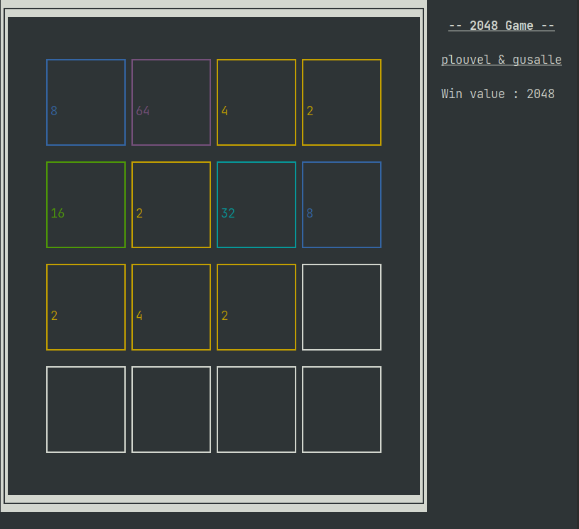

# 42-rush_2048

This rush was about making a 2048 clone in a terminal, using ncurses library.

Made with [gusalle](https://github.com/guillaume-salle)

## Learning ncurses

At first, ncurses seems obscur. The documentation is sometimes not precise when you're searching in the manual page of linux.

I recommand you reading the website of the [author](https://invisible-island.net/ncurses/). It explains a lot on the library :

- Why it has still reachable leaks (if you're going to do this rush, be prepare, it's gonna be a number one topic of the discord rush channel).
- It has a great guide, wrote by two authors : [Writing Programs with NCURSES](https://invisible-island.net/ncurses/ncurses-intro.html). Maybe you won't tackle the whole things in this rush, but this can have some usefull tips and explainations.

## The subject

Like all rush subject, it has a contradiction / weird statement that makes everyone having a different interpretation.

I recommand the safe way : talks with your co-rusher because they probably will evaluate you. If 80% of your co-rusher have the same interpretation, you should discard yours :(

There's the most heared questions about this rush, i'll give my **personal** opinion :

- Is malloc / calloc function allowed ? No, not in the subject, but again : talk with your co-rusher and see if they're willing to accept to use these.
- Do we have to correct all ncurses leaks ? No, according to [ncurses FAQ](https://invisible-island.net/ncurses/ncurses.faq.html#config_leaks).
- Do we have to protect every function of ncurses ? It depends. I only protect function that allocates some memory.

**GOOD LUCK !**
